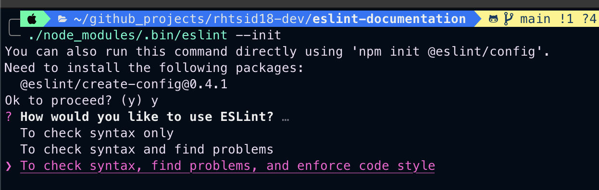

# ESLINT DOCUMENTATION

## Tutorial Reference : <https://www.youtube.com/playlist?list=PL_euSNU_eLbeVd_eDmWzUpEmXizWQRmEm>

## What is ESLint and why to use it: -

- ES stands for ecma-script and linting is the process of identifying the standard problems in your code.
- ESLint is a library that is used for Javascript and is essentially a javascript linter.
- Since Javascript is a dynamically typed language and has various ways to write the same functionality because of the different versions of the code like ES5 and ES6, it has a lot of freedom in the way you can write code.
- This makes the code more vulnerable to basic errors from the developer.
- This is where ESLint comes in using which we can standardize some syntax rules in the project which every developer working on the project has to follow.
- The main goal or usecase of this tool is to make the code more consistent and avoid bugs.
- Example usecase: -

```javascript
function checkPositive(number)
{
    var x = 3;
    if (number > 0) {
        return true;
    }
}

checkPositive(3);
```

- Following are some of the problems with the above showcased example: -
    - The function returns true only when the number is positive
    - Variable x is defined but not used in code.
    - The code works fine but will throw errors in edge case.

- These ^ issues can automatically be handled by ESLint if it is confirgured to address these issues.
- We can and should run ESLint as part of our CI ( Continous Integration ) Pipeline.

## What is the difference between ESLint and Prettier ?

- Eslint is a linter.
- Prettier is a formatter.
- A formatter will not help you in enforcing Code-Quality rules but only formatting rules.
- And as per my current understanding, a Linter will not fully help you with formatting rules also.
- [This](https://prettier.io/docs/en/comparison.html) link comparision between the two on Prettier's official documentation exlains this perfectly.
- The best way to integrate both rules I believe is that we integrate Prettier as an extends or plugin with ESLint and not install prettier separately.

## How to install and use ESLint in your Javascript project: -

- Prerequisite : Node > V10
- ESLint can be installed in two ways: -
    - Globally using the -g flag. ( Not recommended as not all projects have the same linting requirements )
    - locally within the project with the --save-dev flag. ( The recommended approach to more precicesly define the linting rules in your project/workspace )
- In case of local install ( with --save-dev flag ), we can run eslint by going to the directory `./node_modules/.bin/eslint --help`
- If you don't have your package.json initialized then before the ^ step, we would have to run `npm init`.
- After that we can install eslint locally on the project using the command : `npm install --save-dev eslint`
- Before we can run eslint on our project, we need to setup an eslint configuration file which we can initialize with `./node_modules/.bin/eslint --init`.

- When you run the `eslint --init` you will get the following options to choose from: -
    - 
- For the purpose of this document, I have chosen `To check syntax, find problems, and enforce code style`.
- After that there will be some self explanatory questions that you can answer easily based on your project's requirements.
- I prefer to use VSCode as my IDE for coding so on VSCode we should install the ESLint extension which would run the linter as we type our code.

## ESLint configuration file: -

- What is "extends" ?
    - In extends we can add preset configurations which could be as follows: -
        - eslint:recommended ( The standard rules recomended by eslint. )
        - airbnb ( One of the most popular style guides used with eslint. )
- What is "rules" ?
    - In the rules array, you can specify the rules you want which will override the extends templates you have set.
    - You can get a list of all the available eslint rules from [this](https://eslint.org/docs/latest/rules/) page in the eslint documentation.

- What is Abstract Syntax Tree (AST) ?
    - If you want to write your own custom rule which is not available in the default list of rules provided by ESLint, you need to understand some concepts.
    - Abstract Syntax Tree (AST) is one of those concepts.
    - Abstract Syntax Tree (AST) is the javascript object that describes the code.
    - There will be a parser that converts the JS code that we are writing into "Abstract Syntax Tree (AST)"
    - Following are some of the tools that use AST: -
        - Webpack
        - Linters
        - Babel.js
        - Minifiers
        - Syntax Highlighters
    - ESLint by default uses the ESPree javascript parser which converts the javascript code that we write in the project into "Abstract Syntax Tree" (AST).
    - You can actually see your code getting converted into AST using a tool like [astexplorer.net](astexplorer.net)

- What is an ESLint Config and ESLint Plugin and what is the difference between then. ?
    - The rules that you configure in your eslintrc.json ( Config file ) are only usable in your own project/workspace.
    - What if you want to use this same config in a different project/workspace
    - Now you could copy the contents of your eslintrc file and paste it in the other projects eslintrc file.
    - This is not the best way to go because what if in future you want to add a new rule to the config.
    - In that case you would have to create that new rule in every other project where you are using this config.
    - To overcome this issue, we can use sharing of ESLint config.
    - There are two types of things you can share, one is an ESLint config and the other is an ESLint Plugin.
    - Unlike the ESLint config which is a set of pre-existing ESLint rules, an ESLint plugin is a set of custom rules created by you.
    - Similar to the packages on NPM ( Node Package Manager ), these ESLint configs and plugins can be shared by anyone and installed and used by anyone using NPM.
    - ESLint config presets (For example AirBnB which is the most popularly used one) can be used in by putting them in the `extends` array in the eslintrc.json config file.
    - ESLint Plugins contain custom rules and also can contain config settings but doesn't have to.
    - ESLint Plugins can be added by putting them in the `plugins` array in the eslintrc.json config file.
    - Once a plugin is added to the `plugins` array, the rules provided by that plugin can be added to the `rules` array.
    - For example, after adding the react plugin like this `"plugins": ["react"]`, you can add react rules in this manner : `"rules": ["react/no-danger": "error"]`
    - Following are the naming conventions for ESLint config files and ESLint plugin files: -
        - eslint-config-*
        - eslint-plugin-*
    - Basically if you go to the npm website, and then in the search bar you type `eslint-config-`, you will get suggestions for multiple shared eslint-config presets. Same with `eslint-plugin-`, where you will get suggestions for multiple shared eslint-plugins.

----------

### WHERE I AM AT IN THE TUTORIAL RIGHT NOW : -

Completed the 6th video in the playlist. Need to start from video 11 tomorrow since I am not interested in writing my own custom rules in ES Lint.
Note for tomorrow: -

- I don't think I wan't to get into creating custom rules as its very specific usecase and I would be fine with just pre-existing rules or custom rules written by others.
